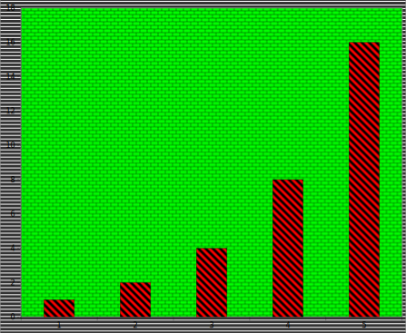
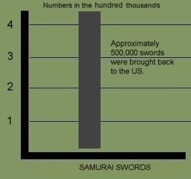
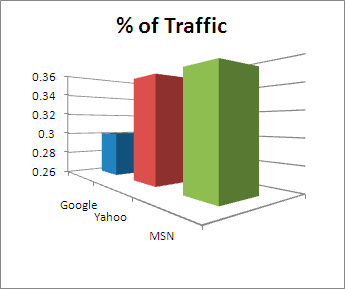
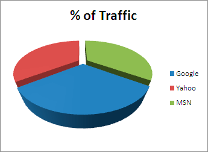
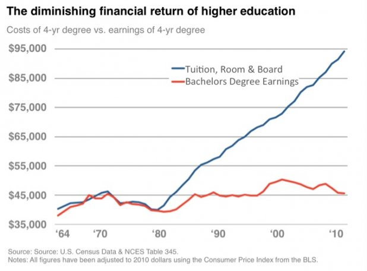
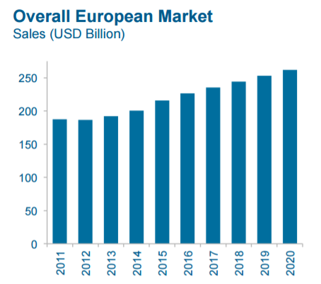
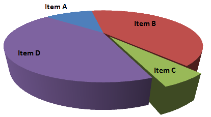
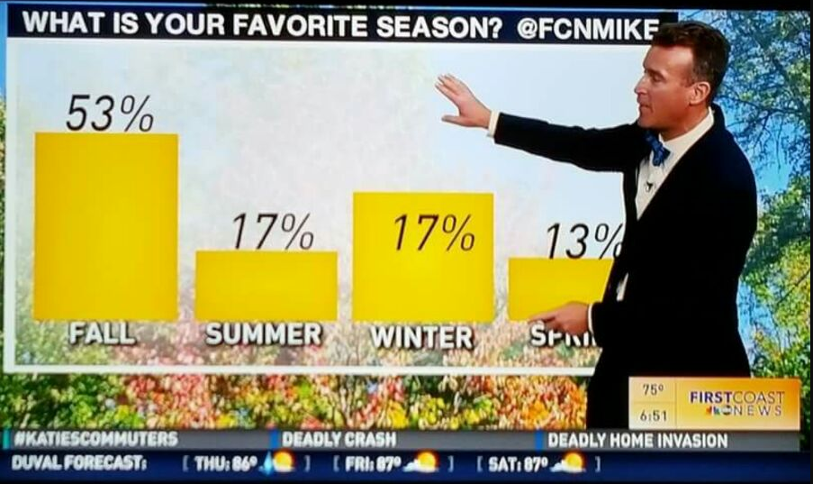
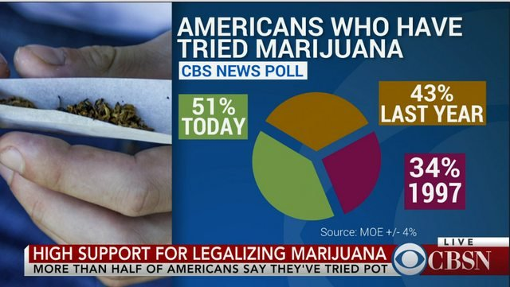

class: inverse, center, middle

# Plotting Principles

```{r setup, include=FALSE}
options(htmltools.dir.version = FALSE)
knitr::opts_chunk$set(echo = FALSE, fig.align = "center")
require(magrittr)
require(tidyverse)
require(plotly)
require(widgetframe)
require(animation)
require(DT)
require(PoEdata)
require(kableExtra)
require(gridExtra)
```

---

# Tufte's principles

- Principles of good practice in data visualisation are outlined in *The Visual Display of Quantitative Information* by **Edward Tufte**. These include:
  - Avoid distorting what the data have to say
  - Present many numbers in a small space
  - Make large data sets coherent
  - Encourage the eye to compare different pieces of data
  
---

# Bad plots

- Tufte also provides a catalog of bad plots.
- What makes these plots *bad* can be put into three categories.
  - Taste (Aesthetic)
  - Perceptual
  - Substantive

---
class: inverse, center, middle

# Errors of taste
---

# An ugly plot

```{r}
knitr::include_graphics('monster.jpg')
```

---

# Chartjunk

- Chartjunk is the inclusion of elements that are not necessary to communicate the information.
- The inclusion of the following can be considered chartjunk:
  + Heavy gridlines.
  + Unnecessary text.
  + Pictures within the chart.

---

# Another example

```{r}

```

---
# Guidelines

Aim for a high Data Ink Ratio

$$\mbox{Data Ink ratio}=\frac{\mbox{Ink used to display data}}{\mbox{Ink used in graphic}}$$

Also aim for a high Data Density

$$\mbox{Data Density}=\frac{\mbox{Number of data points}}{\mbox{Area of graphic}}$$
If data density is small, perhaps use a table

---

#Low data density

```{r}

```


---

# Bad... but not misleading

- Note that although the previous plots look bad, strictly speaking they do not mislead.
- Also maximising data-ink ratio should be seen as a guideline rather than a strict rule.
- For instance the default background for `ggplot2` is arguably chartjunk
- There are good reasons for using it. 

---
# ggplot2

```{r,echo=FALSE}
qplot(x1,y1,data=anscombe)
```

---

# Wickham on the grey background

*"We can still see the gridlines to aid in the judgement of position (Cleveland, 1993b), but they have little visual impact and we can easily "tune" them out... Finally, the grey background creates a continuous field of colour which ensures that the plot is perceived as a single visual entity"*

ggplot2: Elegant Graphics for Data Analyis

---
class: inverse, center, middle

# Errors of Perception

---

# What can we perceive?

- Human perception is a broad field that takes in ideas from psychology and philosophy.
- For data visualisation we can perceive:
  - Length
  - Area 
  - Volume
  - Shape
  - Position
  - Color
  - Angle

---

#Errors of perception

- Data visualisation is all about mapping data to things we can perceive.
- This should not be done in a way that is innacurate or misleading.
- The following plots provide some examples of what can go wrong.

---
# Confusing length and area

```{r}
knitr::include_graphics('mac.jpg')
```

---

# Confusing length and area

- On the previous plot the number of customers is represented by length (height of computer)
- However the *area* of the 2D pictures of computers scale up more than their *heights*.
- Also the picture leads us to imagine a 3D computer making this effect worse.
- The value for *Mac* is only about 3 to 4 times more than for *None* but we perceive the difference to be much more.

---

# Beware 3D

```{r}

```

---

# Beware 3D

```{r}

```

---
# Beware 3D

- Difficult to line up the heights of bars with the actual values
- Closer green bar (MSN) looks bigger.
- On the pie chart rendering in 3D makes the blue segment (Google) look the biggest.
- Do not use three dimensions when two will work well.

???

https://infolific.com/technology/internet/seo-lie-factor/

---

# Lie Factor

The lie factor is given by

$$\mbox{Lie factor}=\frac{\mbox{Size of effect in graph}}{\mbox{Size of effect in data}}$$
- The lie factor should be 1.

---

# Road miles (from Tufte)

```{r}
knitr::include_graphics('Lie_factor_example1_image.jpg')
```

---

#Effects

- The data says that mileage rose from 18 to 27.5 which is a 53% increase.
- The line on the graph increases from 0.6 inches to 5.3 inches which is a 783% increase!
- The lie factor is $783/53\approx 14$

---

# The y-axis

<video width="640" height="480" controls>
  <source src="voxyaxis.webm" type="video/webm">
</video> 

---

# The y-axis

- Are we interested in the size of the variable rather than changes in the variable?
- Is zero a reasonable value for the variable to take?
- Are we using a bar chart?
- Answering yes to these questions means we should give more consideration to including zero on the y-axis.

---
class: inverse, middle, center
# Errors of Substance

---
# Errors of Substance

- Sometimes there is nothing wrong with the plot but with the data.
- On the following slide is a plot comparing the cost of going to college in the US against the salaries of college graduates.
- Can you find problems with this graph?

---

# College cost

```{r}

```

---

# Problems

- There is nothing *incorrect* about this graph.
- However the message is misleading.
- The income is a yearly income while the cost of college is over four years (and only paid once).
- Also it does not show the income of people who are not college graduates.

---
class: inverse, middle center

# More bad plots

---

# Electrolux

```{r}
knitr::include_graphics('Consultantsmind-Electrolux-Profit-then-Growth.png',dpi=110)
```

???

Data-to-ink ratio is zero

---

# McKesson

```{r}

```

???

Forecast not in different colour

---

# McKinsey

```{r}
knitr::include_graphics('Consultantsmind-McKinsey-Gig-Economy-Messy-Slide.jpg')
```

---

# Pizza

```{r}
knitr::include_graphics('Its-a-pizza-Chart-Not-a-Pie-chart-1.png',dpi = 150)
```

???

Chart junk numbers do not add up

---


# Pie chart

```{r}

```

???

3d makes one slice look small

---

# Climate Change

```{r}
knitr::include_graphics('Nature-climate-change.png',dpi=120)
```


---

#Season

```{r}

```

???

lie factor

---
# Narcotics

```{r}

```


---


# Summary

- Graphs can be misleading
- The default options in ggplot are chosen to protect the user from errors of taste and errors of perception.
- Nothing protects you from using bad or misleading data...
- ...except for your own common sense