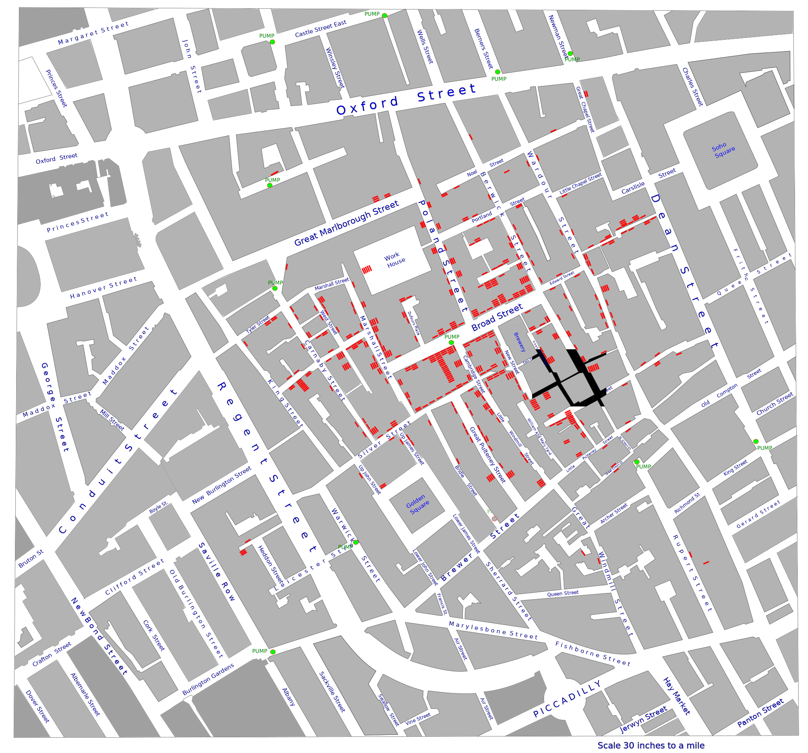
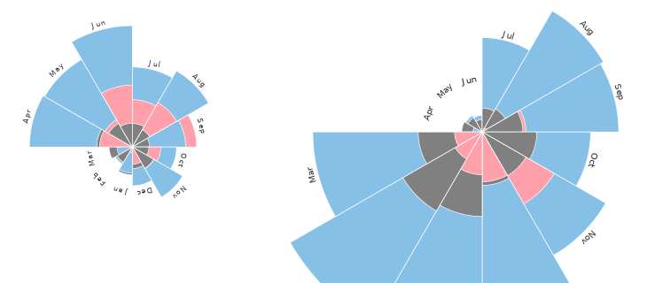

class: inverse, center, middle

# Housekeeping

```{r setup, include=FALSE}
options(htmltools.dir.version = FALSE)
knitr::opts_chunk$set(echo = FALSE, fig.align = "center")
require(magrittr)
require(tidyverse)
require(plotly)
require(widgetframe)
require(animation)
require(DT)
require(PoEdata)
require(kableExtra)
require(gridExtra)
rm(list=ls())
```

---

# Welcome

- Lecturer: Anastasios Panagiotelis
- Email:
    + <a href="mailto:anastasios.panagiotelis@monash.edu">anastasios.panagiotelis@monash.edu</a>
- Lecture slides and tutorial exercises.
- <a href="https://socviz.co/">Data Visualisation: A practical introduction by Kieran Healey</a>

---

# My Slides

- My slides are designed to be interactive.  
- They are best viewed in a web browser 
    + Google Chrome and Firefox work best.
- Sometimes interactive plots won't look right or you will get stuck. 
    + Just refresh (press F5).
- For a pdf version of the slides, from within Google Chrome simply print.  There will be an option to print to pdf.    

---

class: inverse, center, middle

# A History Lesson

---

# Cholera

- In 1854 there was a breakout of the cholera disease in London killing 616 people.
- At the time it was speculated that the disease was carried in the air.
- A physician called John Snow was sceptical and began to collect data.

---

# Snow's map


```{r snow,eval=TRUE}
  knitr::include_graphics('img/Snow-cholera-map.jpg',dpi = 40)
```

---

# Snow's map

```{r snowres,eval=TRUE}
  
```

---

# Consequences

- The map showed that cholera was more prevalent around a water pump on Broad Street.
- The pump was closed down.
- Eventually it was established that cholera is a water-borne disease.
- Data visualisation saves lives!

---

# Crimean War

- At the same time Great Britain was at war against Russia in the Crimean peninsula.
- Florence Nightingale is famous as a nurse who treated the wounded soldiers.
- She also advocated British Parliament for more sanitary conditions in military hospitals.
- She knew the power of using data visualisation.

---

# Nightingale's Rose chart

```{r nightingale,eval=TRUE}
knitr::include_graphics('img/florose.jpg',dpi=40)
```

---
# Nightingale's Rose chart 

```{r nightingaleres,eval=TRUE}

```

- Blue areas: Preventible deaths.
- Red areas: Deaths from battle wounds.
- Black areas: Other causes.

---

# Aftermath

- The improved sanitation at military hospitals was eventually implemented in civilian hospitals.
- Data visualisation saves lives.
- Florence Nightingale became the first female member of the Royal Statistical Society.
---

# Napoleon

- In 1812 Napoleon thought it was a good idea to invade Russia.
- This campaign was a disaster for the French.
- Engineer Charles Joseph Minard captured the extent of this catastrophe using visualisation.

---

# Minard's plot

```{r minard}
knitr::include_graphics('img/Minard_Map.svg')
```

---

# Minard's plot

- This visualisation provides information on 6 variables in one chart.
  - Number of troops.
  - Whether troops advance or retreat.
  - Temperature and time.
  - Longitude and latitude.
- Despite the clear message that invading Russia in winter is a bad idea, some people did not learn this lesson.

---

# Why visualisation?

- Gain insights from data.
- Overview of large datasets.
- Search for: 
    + Trends
    + Relationships
    + Irregularites
- In business data visualisation is a crucial tool to support decision making.
---
class: inverse, center, middle

# Modern Times

---

# The R language

- Modern software tools make visualisation easily accessible.
- In this unit we will use the **R programming language** which  can be downloaded [here](http://cloud.r-project.org/).
- Exact details of installing R will depend on whether you use Windows, Mac or Linux.
- A great tool for both new and experienced users of R is **RStudio** which can be downloaded [here](https://www.rstudio.com/products/RStudio/).

---

# Using R

- To keep track of your workflow use a **script**:
  - You can open a new script by typing Ctrl+Shift+N
  - You can run a single line of code by pressing Ctrl+Enter
  - You can run a whole script by pressing Ctrl+Shift+S or Ctrl+Shift+Enter
- You can save scripts to run them anytime.
- Scripts allow you to keep analysis **replicable** which is important in research and business.
  
---

# Variables in R

- In R everything is stored in a **variable**. Here the word variable has a slightly different meaning to the usual statistical meaning. 
- In R, think of variables as little boxes or envelopes with names on them.
- We can put a number into these boxes, or words or matrices or entire blocks of data or even other boxes.

---

# Assigning Variables

- How to store the number 1 in a variable `a` and the number 2 in a variable `b`?
```{r, echo=TRUE}
a<-1
b=2
```
- Note that you can use either `<-` or `=` to assign variables. 

---

# Seeing results

There are a few options for looking at what is stored in a variable

```{r, echo=TRUE}
print(b)
b
str(b)
```


---

# Character variables

- We can store more than just numbers in a variable.  
- Try to store your own name in a variable called `name`.
```{r, echo=TRUE}
name<-'Anastasios'
str(name)
```
- You must use apostrophes otherwise R will look for a variable called `Anastasios`.

---

# Variable Names

- Variable names can include letters, digits, the full stop `.` and the underscore `_`
- The variable name cannot begin with a number or underscore.
- They can begin with a full stop but only if the second digit is a letter.
- For more details type `?make.names` into your R console

---

# Valid and Invalid

- Valid:
  - `FirstName`
  - `First.Name`
  - `First_Name`
  - `.FirstName`
- Invalid:
  - `1stName`
  - `.1stName`
  - `_First.Name`
  - `First Name`
  - `FirstName?`
---

#Foreign Languages

- R has support for foreign languages, but the same rules apply
- Valid:
  - `Όνομα`
  - `название`
  - `名字`
  - `이름`
- Invalid:
  - `1Όνομα`
  - `.название`
  - `名 字`

---

# Case Sensitivity

- R is case sensitive.
- This means that the following are all different:
  - `Name` 
  - `name`
  - `NAME`
  - `nAMe`

---

# Workspace

- All variables are kept in the **workspace**.  You can see what is in your workspace by using the command

```{r,echo=TRUE}
ls()
```

---

# Clear Workspace

- You can clear the workspace using

```{r,eval=FALSE,echo=TRUE}
rm(list=ls())
```
- If you try ls() again the workspace will be empty.  
- In RStudio you  can also see all the variables in the *Environment* tab.
- It is worth clearing the workspace at the beginning of every script.

---

# Working directory

- If you try to read data from your hard drive, or save plots or data then the concept of a **working directory** is important.  To check your working directory type

```{r,eval=TRUE,echo=TRUE}
getwd()
```

- To change the working directory use `setwd` 

```{r,eval=FALSE,echo=TRUE}
setwd("/home/anastasios/Documents")
```

---

# Basic arithmetic in R

- Basic arithmetic is fairly simple.  Try `a+b`.  Also we will put this in a new variable called `z`.

```{r,echo=TRUE}
z<-a+b
str(z)
```

- To subtract use `-`, to multiply use `*`, to divide `/` and to take powers use `^`.

---

# Functions in R

- Apart from very simple arithmetic, variables in R are manipulated using a **function**.  
- The input  (also called argument) goes in parentheses, while the output can be assigned to a new variable.
- Some functions take more than one input.  In this case separate by commas.

---

# Example

- The function `sqrt` takes the square root.  

```{r, eval=TRUE, echo=TRUE}
rootb<-sqrt(b)
str(rootb)
```

What happens when you take a square root of something that is not a number?

```{r, error=TRUE, eval=TRUE,echo=TRUE}
rootname<-sqrt(name)
```

---

# Getting Help

- If you aren't sure what a function does, use R help.  The easiest way is to simply use the `?`

```{r, echo=TRUE,eval=FALSE}
?sqrt
```

- If you want to do something and do not know the name of the relevant function you can search using `??`.  Try to find a function to do logarithms using

```{r, echo=TRUE,eval=FALSE}
??logarithms
```

---

# Comments

Anything after a `#` will not be executed by R.
```{r, error=TRUE, eval=TRUE, echo=TRUE}
a<-1 # Set the variable a to 1
#x<-4 This line is not executed 
str(a)
str(x)
```
Comment multiple lines using Ctrl+Shift+C

---

# Vectors

We can create a variable with multiple numbers or strings using the `c` function.
```{r, echo=TRUE}
Consumption<-c(50,40,25,0)
str(Consumption)
Drink<-c('Coke','Pepsi','Coke','Homebrand')
str(Drink)
```

---

# Vector

These variables are example of a **vector**.  Sometimes when we apply a function to a vector, we apply the function to each element.

```{r, echo=TRUE}
logcons<-log(Consumption)
str(logcons)
```


---

# Vectors

Other functions take a vector as an input and return a single number as the output

```{r, echo=TRUE}
meancons<-mean(Consumption)
str(meancons)
```

---

# Inf and NaN

There are *special* values that numeric variables can take.  These are `Inf` and `-Inf` for positive and negative infinity and `NaN` for not a number.  The presence of `NaN` indicates an error.

```{r, echo=TRUE}
log(-1)
```

It is important to distinguish `NaN` from `NA`. The latter is used for missing data.

---

# Lists

Another object common in R is known as a **list**.  A list can contain completely different types of variables.
```{r, echo=TRUE}
alist<-list(w=name, x=Drink, y=Consumption)
```
elements of lists are accessed using `[[]]` or `$`
```{r, echo=TRUE}
alist[[1]]
```

---

class: center, inverse middle

# Packages

---

# R Packages

- A big advantage of R is the use of add-on packages,  easily downloaded from an online repository called **CRAN**.  
- Using a package involves two steps:
  - Download and install the package using the function `install.package` (do once).
  - Load the package using `library` function (include at beginning of script).
- Both these steps can also be done in RStudio through the *Packages* tab.

---

# Options in installing packages

- If you have not already done so, download, install and load the R package `ggplot2`

```{r, eval=FALSE,echo=TRUE}
install.packages('ggplot2')
```
To load the package
```{r,echo=TRUE}
library(ggplot2)
```

- By downloading the package you also download all of the help documentation.

---

# The tidyverse

- When you have time, download the `tidyverse` package
- This is a question in your tutorial exercises but please do this before next week.
- The `tidyverse` is a collection of packages.
    + `readr` is used for reading in data.
    + `dplyr` and `tidyr` is used for manipulating data into an easy to use format.
    + `ggplot2` is used for visualisation.

---
class: inverse, middle center

# Anscombe's quartet

---

# Plotting data

- Anscombe's quartet is a synthetic dataset used to demonstrate the importance of data visualisation.
- We will also use it to learn some basic R.
- The data comes built into R.  
- There are 4 pairs of x and y variables.

---

#Anscombe's quartet

```{r,echo=TRUE, eval=TRUE}
str(anscombe)
```

---

# Summary stats

- We can find the mean of the final pair using the `mean` function.

```{r, echo=T}
xbar<-mean(anscombe$x4)
ybar<-mean(anscombe$y4)
str(xbar)
str(ybar)
```

---

# Summary stats

- We can find the variance of the final pair using the `var` function.

```{r, echo=T}
vx<-var(anscombe$x4)
vy<-var(anscombe$y4)
str(vx)
str(vy)
```
---

# Summary stats

- We can find the correlations between x and y using the `cor` function.

```{r, echo=T}
rxy<-cor(anscombe$x4,anscombe$y4)
str(rxy)
```

- There are two inputs or *arguments* to the function.  Separate these using a `,`

---

# Your turn

- If your birthday is from January to April:
  - Find the mean and variance of x1 and y1 and their correlation
- If your birthday is from May to August:
  - Find the mean and variance of x2 and y2 and their correlation
- If your birthday is from September to December:
  - Find the mean and variance of x3 and y3 and their correlation
  
---
# Conclusions

- Results
  - The means of all x variables are `r mean(anscombe$x4)%>%round(2)`
  - The means of all y variables are `r mean(anscombe$y4)%>%round(2)`
  - The variances of all x variables are `r var(anscombe$x4)%>%round(2)`
  - The variances of all y variables are `r var(anscombe$y4)%>%round(2)`
  - The correlation between x and y is `r cor(anscombe$x1,anscombe$y1)%>%round(2)`
- Does this mean all datasets are equal?

---

# Let's visualise

- Later on we will use the `ggplot` function to create figures.
- For now we can use a simple function within the `ggplot2` package called `qplot`.
- Simply tell `qplot` the variable(s) that you want to plot and the dataset.
- The `qplot` function tries to guess what type of plot you want.

---

# Histogram

```{r,echo=T,message=FALSE,fig.height=6}
qplot(x4,data = anscombe)
```

---

# Scatterplot

```{r,echo=T,message=FALSE,fig.height=6}
qplot(x4,y4,data = anscombe)
```

---

#Your turn

- If your birthday is from January to April:
  - Plot histograms of x1 and y1 and a scatterplot.
- If your birthday is from May to August:
  - Plot histograms of x2 and y2 and a scatterplot.
- If your birthday is from September to December:
  - Plot histograms of x3 and y3 and a scatterplot.
---

# All Results

```{r,echo=F,message=FALSE,fig.height=6}

p1<-qplot(x1,y1,data = anscombe)
p2<-qplot(x2,y2,data = anscombe)
p3<-qplot(x3,y3,data = anscombe)
p4<-qplot(x4,y4,data = anscombe)

grid.arrange(p1,p2,p3,p4)

```

---

# Visualisation

- Although all four datsets have the same summary stats they are vastly different.
- These differences can easily be seen using visualisation.
- Always look at your data as part of an analysis.

---

# Where now

- Clearly `qplot` is quite limited in what it is able to do.
- Over the next period we will consider:
  + More ways to plot a single variable.
  + More ways to plot relationships between two or more variables.
  + Visualising variables that are categorical.
- Before getting into those details we cover some general principles of good plotting.

