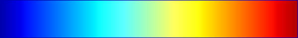
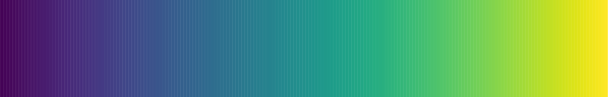

class: inverse, center, middle

# Beyond two dimensions

```{r setup, include=FALSE}
options(htmltools.dir.version = FALSE)
knitr::opts_chunk$set(echo = FALSE, fig.align = "center")
require(magrittr)
require(tidyverse)
require(plotly)
require(widgetframe)
require(animation)
require(DT)
require(PoEdata)
require(kableExtra)
require(gridExtra)
require(ggmosaic)
require(GGally)
```

---

# Visualising many variables

- We can do more than visualise variables spatially
  - Colour
  - Size
  - Label
  - Facets

---

# An example
<video width="720" height="480" controls>
  <source src="img/Rosling.webm" type="video/webm">
</video>
---

# Mpg data

- The variable `cty` measures fuel efficiency of different cars in the city, while `displ` measures the size of the engine.
- These are negatively correlated.
- We can also see how the non-metric variable `drv` interacts with these variables using the `col` (colour) aesthetic.

---

# Using color

```{r, echo=TRUE,fig.height=6}
ggplot(data = mpg,mapping = 
         aes(x=displ,y=cty, col=drv))+geom_point()  
```

---

# Aes v geom

- Note that unlike the last lecture, color is being used here to display information about a variable in the dataset.
- Therefore instead of specifying color in the geom, it has to be specified in the `aes` function.
- Remember the `aes` function maps data to something we can perceive.

---

# Text labels

- Another option is to plot text rather than points
  - This is in fact a different geom called `geom_text`
  - This was used on some of the plots demonstrating Zipf's Law
- A variable can be mapped to the actual text that appears
  - The aesthetic is `label`

---

#With text

```{r, echo=TRUE,fig.height=5}
ggplot(data = mpg,mapping = 
         aes(x=displ,y=cty, label=drv))+geom_text()  
```

---

# The bubble chart

- To add a fourth variable we can manipulate the size of the points.
- This is known as a bubble chart.
- The aesthetic in question is `size`
- The following plot maps the number of cylinders to the size of points.

---

# Bubble plot

```{r, echo=TRUE,fig.height=5}
ggplot(data = mpg,mapping = 
         aes(x=displ,y=cty, col=drv,size=cyl))+
  geom_point()  
```

---
class: inverse, middle, center

# All about colourmaps

---

# Color scales

- Suppose we are mapping metric or ordinal data to a colormap.  The colormap should be
  - Sequential
  - Perceptually uniform
  - Work when printed in black and white
  - Accessible to colorblind people
  - Colorful and pretty
- The *viridis* colormap was developed with this in mind

---

# Jet v Viridis

A popular palette is jet.

```{r}

```

A better palette (by the above criteria) is viridis

```{r}

```

---

# Problems with jet

- Colors close to one another should be similar.
- On jet, in some parts the color changes dramatically over a small range.
- Also colorblind people (about 8% of the population) can have difficulty with the red colors in jet.
- For more on this see <a href="https://www.youtube.com/watch?list=PLYx7XA2nY5Gcpabmu61kKcToLz0FapmHu&v=xAoljeRJ3lU"> this talk</a> by the creators of viridis.

---

# Jet Colormap

```{r}
knitr::include_graphics('img/mona-lisa-rainbow.png',dpi = 100)
```


---

#Viridis colormap

```{r}
knitr::include_graphics('img/mona-lisa-gradient.png',dpi = 100)
```

---

# In ggplot2

Ordered factors now use viridis by default.

```{r,echo=TRUE,fig.height=4}
ggplot(diamonds,aes(y=price,x=carat,col=cut))+
  geom_point(size=0.2) 
```

---

# Continous color

```{r, echo=TRUE,fig.height=6}
ggplot(data = mpg,mapping = 
         aes(x=displ,y=cty, col=hwy))+geom_point()  
```

---
# Continous color

- To use viridis for a continous variable simply add `scale_color_viridis_c()`.  
- Scale is another element of the grammar of graphics. 

```{r, echo=TRUE,eval=FALSE}
ggplot(data = mpg,mapping = 
         aes(x=displ,y=cty, col=hwy))+
  geom_point()+scale_color_viridis_c()  
```

---

# Viridis

```{r, echo=FALSE,fig.height=6}
ggplot(data = mpg,mapping = 
         aes(x=displ,y=cty, col=hwy))+
  geom_point()+scale_color_viridis_c()  
```

---


# Variations on Viridis

```{r, echo=TRUE,fig.height=5}
ggplot(data = mpg,mapping = 
         aes(x=displ,y=cty, col=hwy))+
  geom_point()+scale_color_viridis_c(option = 'C')  
```

---

# Caution

- There are some situations where viridis may not be ideal.
  - Nominal variables
  - Divergent scales
- Divergent scales can be used when there is a natural middle point for the data (usually zero).
- For when plotting budget or trade balances using color, red can be used to show deficit and blue can be used to show surplus.

---

# Divergent Scale

```{r, echo=TRUE,fig.height=5}
ggplot(data = mpg,mapping = 
         aes(x=displ,y=cty, col=hwy))+
  geom_point()+scale_color_distiller(type = 'div')  
```

---
class: inverse, middle, center

# Facetting
---

#Facetting

- Sometimes we cannot display everything on a single plot
- In this case facetting can be used to construct multiple plots
- For the next example we look at the `txhousing` dataset
---

# Code for facetting

```{r,echo=TRUE,eval=FALSE}
ggplot(data = txhousing, 
       mapping = aes(x=date, y=sales))+
  geom_line()+
  facet_wrap(~city)
```


Note the tilde (`~`) in `~city`

---

#Texas Housing

```{r,echo=FALSE,eval=TRUE}
ggplot(data = txhousing, 
       mapping = aes(x=date, y=sales))+
  geom_line()+
  facet_wrap(~city)
```

---

# Scales

- A problem here is that due to the scaling on the y axis, only the large cities display anything interesting.
- The option `scales` in the `facet_wrap` function allows each plot to have its own scale.
- Use this with caution!

---

#Free scales

```{r,echo=TRUE,eval=FALSE}
ggplot(data = txhousing, 
       mapping = aes(x=date, y=sales))+
  geom_line()+
  facet_wrap(~city,scales = 'free_y')
```
---

#Texas Housing

```{r,echo=FALSE,eval=TRUE}
ggplot(data = txhousing, 
       mapping = aes(x=date, y=sales))+
  geom_line()+
  facet_wrap(~city,scales = 'free_y')
```

---

#Change number of rows

- The number of rows or columns can be changed with the `nrow`
or `ncol` arguments
```{r,echo=TRUE,eval=FALSE}
ggplot(data = txhousing, 
       mapping = aes(x=date, y=sales))+
  geom_line()+
  facet_wrap(~city,scales = 'free_y',nrow = 12)
```


---


#Changing number of rows

```{r,echo=FALSE,eval=TRUE}
ggplot(data = txhousing, 
       mapping = aes(x=date, y=sales))+
  geom_line()+
  facet_wrap(~city,scales = 'free_y',nrow = 12)
```
---

# Facet grid

- We can also facet so that the rows correspond to one categorical variable and the columns to another.
- Lets try this with the diamonds dataset

```{r, echo=TRUE,eval=FALSE}
ggplot(data = diamonds, 
       mapping = aes(x=carat, y=price))+
  geom_point()+
  facet_grid(rows = vars(cut), cols = vars(color))

```

---

#Facet grid

```{r, echo=FALSE,eval=TRUE}
ggplot(data = diamonds, 
       mapping = aes(x=carat, y=price))+
  geom_point()+
  facet_grid(rows = vars(cut), cols = vars(color))

```
---

#Your Turn

- Plot a scatterplot with
  + Sales on the x axis
  + Median on the y axis
  + Facet by year on the rows
  + Facet by month in the columns
  
---

# Solution

```{r, echo=T,eval=F}
ggplot(data = txhousing, 
       mapping = aes(x=sales, y=median))+
  geom_point()+
  facet_grid(rows = vars(year), cols = vars(month))

```

---

class: inverse, middle, center

# Higher Dimensions

---

# Pairs plot

- A pairs plot gives an array of plots
  - On the diagonal there are kernel densities or barplots
  - On the lower diagonal are scatterplots or facetted histograms
  - On the upper diagonal are correlations or boxplots.
- This can be implemented using the *ggpairs* function in the *GGally* package.

---

# Economics data

```{r,echo=TRUE,message=FALSE, fig.height=5}
ggpairs(economics)
```

---

# The Iris data


- The iris data is an old dataset on three species of flower with different measurements of the flower.
- The aim is to classify each flower into its species.
- However since it has a mix of metric and non-metric variables it is often used an an example for demonstration.  

---

# Iris data

```{r,echo=TRUE,message=FALSE, fig.height=5}
ggpairs(iris)
```

---

# Parallel Coordinates

- A parallel coordinates plots the variables of all values along the y axis.
- The variables themselves appear along the x axis.
- Values corresponding to the same observation are joined up by lines.
- They can often look messy but sometimes provide insight.

---

# Parallel Coordinates

```{r,echo=TRUE,message=FALSE, fig.height=5}
ggparcoord(iris)
```
---

# Summary

- By now we can do a large variety of plots in `ggplot`.
- However so far we have only used datasets that are already clean and tidy.
- Next we learn:
  - How to read in data from a file
  - How to manipulate the data into a form that we want to use.
  - How to reshape the data in a way that it works well with `ggplot`.