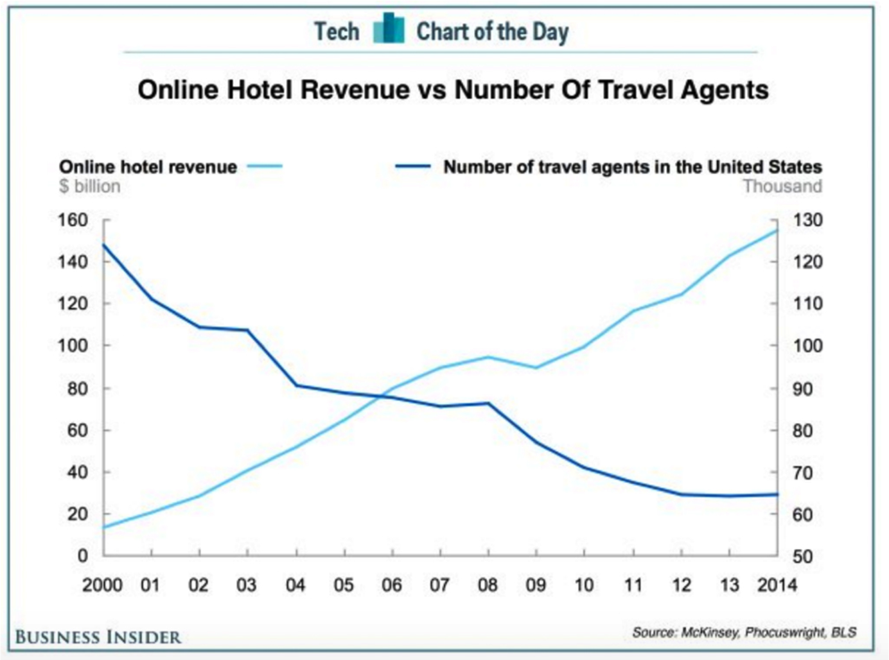

class: inverse, center, middle

# Minor adjustments

```{r setup, include=FALSE}
options(htmltools.dir.version = FALSE)
knitr::opts_chunk$set(echo = FALSE, fig.align = "center")
require(magrittr)
require(tidyverse)
require(plotly)
require(widgetframe)
require(animation)
require(DT)
require(PoEdata)
require(kableExtra)
require(gridExtra)
require(ggmosaic)
require(ggthemes)
```

---

# Minor adjustments

- Sometimes we would like to add a title to a plot or change the labels.
  - This is achieved by `labs`
- Sometimes we may wish to change the general look
  - This is achieved by the `theme` function and functions in the `ggthemes` package.

---

# Change labels

```{r, echo=TRUE,fig.height=4}
economics%>%
  ggplot(aes(x=psavert,y=uempmed))+
  geom_point()
```

---
# Change labels

```{r, echo=TRUE,fig.height=4}
economics%>%
  ggplot(aes(x=psavert,y=uempmed))+
  geom_point()+labs(title = 'Savings v Duration')+
  xlab('Savings Rate')+
  ylab('Medium Duration of Unemployment')
```

---
# Change theme

```{r, echo=TRUE,fig.height=4}
economics%>%
  ggplot(aes(x=psavert,y=uempmed))+
  geom_point()+theme_classic()
```

---
# Change theme

```{r, echo=TRUE,fig.height=4}
economics%>%
  ggplot(aes(x=psavert,y=uempmed))+
  geom_point()+theme_bw()
```

---
# One from ggthemes

```{r, echo=TRUE,fig.height=4}
economics%>%
  ggplot(aes(x=psavert,y=uempmed))+
  geom_point()+theme_economist()
```

---

# Another from ggthemes

```{r, echo=TRUE,fig.height=4}
economics%>%
  ggplot(aes(x=psavert,y=uempmed))+
  geom_point()+theme_wsj()
```
---

# Theme

- You can customise your own themes using the `theme` function.
- There are many guides for using this
- One can be found <a href="http://www.sthda.com/english/wiki/ggplot2-themes-and-background-colors-the-3-elements">here</a>. 

---

# Annotation

- Remember that plots tell a story.
- Sometimes it helps to add text to a plot to help tell this story.
- This can be done with the `annotate` function.
---

#Annotate

```{r, echo=TRUE,fig.height=4}
economics%>%
  ggplot(aes(x=psavert,y=uempmed))+
  geom_point()+ annotate('text',
   x=4,y=24,label='Bad Times!',size=5,col='red')
```

---
class: inverse, middle, center

#More on time series

---
#Many time series on one plot

- It is common to see multiple time series on a single plot.
- This can be achieved using the `group` aesthetic.
- We will do this with the `txhousing` data.
- Suppose we are looking at `sales` and `listings` since 2010 for Houston only.

---

#Houston Data

```{r, warning=FALSE, message=FALSE,fig.height=5, eval=FALSE,echo=TRUE}
txhousing%>%
  filter(city=='Houston',date>2010)%>%
  select(date,sales,listings)->houston_sales_listings

houston_sales_listings%>%
  pivot_longer(cols = -date, 
               names_to = 'variable', 
               values_to = 'value')%>%
  ggplot(aes(x=date,y=value,group=variable))+
  geom_line()
```

---

#Houston Data

```{r, warning=FALSE, message=FALSE,fig.height=5, echo=FALSE}
txhousing%>%
  filter(city=='Houston',date>2010)%>%
  select(date,sales,listings)->houston_sales_listings

houston_sales_listings%>%
  gather('variable','value',-date)%>%
  ggplot(aes(x=date,y=value,group=variable))+
  geom_line()
```

---

# Beware

- Plotting time series measured in different units on the same plot is very very risky.
- Something commonly seen is a plot with two time series but with different y axes.
- For some debate on this issue see <a href='https://stackoverflow.com/questions/3099219/ggplot-with-2-y-axes-on-each-side-and-different-scales/3101876#3101876'> this discussion </a>.
- Crossing points can be manipulated by arbitrarily changing the scale.

---

# Crossing points

```{r}

```

---

# Aspect Ratio

- Another issue when looking at time series plots is the aspect ratio.
- The aspect ratio is the ratio of the width to the height of the plot.
- For time series plot larger aspect ratios can make trends look smaller.
- Aspect ratio can be controlled through the `coord_fixed` function

---

#Aspect Ratio

```{r, echo=TRUE, eval=FALSE}
houston_sales_listings%>%
  ggplot(aes(x=date,y=sales))+
  geom_line()+
  coord_fixed(ratio=0.002)

houston_sales_listings%>%
  ggplot(aes(x=date,y=sales))+
  geom_line()+coord_fixed(0.0001)
```

---

#Aspect Ratio

```{r, fig.height=4}
houston_sales_listings%>%
  ggplot(aes(x=date,y=sales))+
  geom_line()+
  coord_fixed(ratio=0.002)
```

```{r, fig.height=4}
houston_sales_listings%>%
  ggplot(aes(x=date,y=sales))+
  geom_line()+coord_fixed(0.0001)
```

---

# Banking to 45

- An old rule of thumb suggested by Cleveland is *banking to 45 degrees*
- Find the slopes of every line joining a point at time $t$ to the the point at time $t+1$.
- Set the aspect ratio so that the median of these is 45 degrees.
- It is only a rough guide and has recently been called into question.

---
# Alternatives

- If we are looking for the relationship between two variables it is often better to look at a scatterplot.
- A problem with this is that the dimension of time is lost.
- Time can however be represented using color and the `geom_path` geometry.
---
#Scatter plot

```{r, echo=TRUE,fig.height=5}
houston_sales_listings%>%
  ggplot(aes(x=listings,y=sales))+
  geom_point()
```
---
#Path plot

```{r, echo=TRUE,fig.height=5}
houston_sales_listings%>%
  ggplot(aes(x=listings,y=sales, col=date))+
  geom_path()+scale_color_viridis_c()
```

---
class: middle, center inverse

# Modelling


---

# Modelling

- Often visualisation is conducted with modelling in mind
- Scatterplots can be visualised with a model fit as well
- This is done using `geom_smooth` 
- We can illustrate using the `mpg` data.

---

# Scatterplot

```{r}
ggplot(mpg,aes(x=displ,y=cty))+
  geom_point()

```
---

# With fitted curve

```{r, message=FALSE,echo=TRUE,fig.height=6}
ggplot(mpg,aes(x=displ,y=cty))+
  geom_point()+geom_smooth()

```


---
# Smooth fit

- The fitted line by default comes from the LOcal Estimated Scatterplot Smoothing (LOESS) method.
- This technique combines the idea of nearest neighbours with regression.
- Nearest neighbours are found (along the x-axis)
- A constant, linear or quadratic regression is fit to the nearest neighbours.

---

# Nearest Neighbours

```{r}
set.seed(6)
k<-4
q<-1
x=runif(20)
y=runif(20)
d<-abs(x-x[q])
c<-sort(d)[k+1]
nn<-rep('x',20)

nn[q]<-'x0'
df<-tibble(x=x,y=y,nn=nn)

ggplot(df,aes(x=x,col=nn))+geom_rug(size=1.5)+theme(legend.position = 'none')+scale_color_manual(values = c("#56B4E9", "#009E73"))+geom_point(data = df[2:20,],mapping = aes(x=x,y=y),size=3)
```

---

#Nearest Neighbours

```{r}
nn[(d<=c)]<-'nn'
nn[q]<-'x0'
df<-tibble(x=x,y=y,nn=nn)

ggplot(df,aes(x=x,col=nn))+geom_rug(size=1.5)+theme(legend.position = 'none')+geom_point(data = df[2:20,],mapping = aes(x=x,y=y,col=nn),size=3)+scale_color_manual(values = c("#E69F00", "#56B4E9", "#009E73"))
```

---

# Local fit

```{r}
ggplot(df,aes(x=x,col=nn))+geom_rug(size=1.5)+theme(legend.position = 'none')+geom_point(data = df[2:20,],mapping = aes(x=x,y=y,col=nn),size=3)+scale_color_manual(values = c("#E69F00", "#56B4E9", "#009E73"))+geom_smooth(data = filter(df,nn=='nn'),mapping = aes(x=x,y=y),method = 'lm',se = F)
```

---

#Nearest Neighbours

```{r}
lmloc<-lm(data = filter(df,nn=='nn'),y~x)
y0<-predict.lm(lmloc,newdata = filter(df,nn=='x0'))%>%as.numeric
df$y[q]<-y0

ggplot(df,aes(x=x,col=nn))+geom_rug(size=1.5)+theme(legend.position = 'none')+geom_point(data = df[2:20,],mapping = aes(x=x,y=y,col=nn),size=3)+scale_color_manual(values = c("#E69F00", "#56B4E9", "#009E73"))+geom_smooth(data = filter(df,nn=='nn'),mapping = aes(x=x,y=y),method = 'lm',se = F)+geom_point(data = filter(df,nn=='x0'),mapping = aes(x=x,y=y),size=10,shape='x')
```

---

#Details

- In the LOESS algorithm, the smoothing parameter $\alpha$ is defined as the proportion of observations used as nearest neigbours.
  - If $\alpha=0.2$ and $n=20$ then $k=4$ nearest neighbours are used.
  - By default $\alpha=0.75$ in R.
- It is common to use weighted regression whereby closer neighbours are given more influence.
- LOESS is not ideal for large datasets.

---

# Linear fit

Linear regression can be used instead of LOESS

```{r,echo=TRUE,fig.height=4}
ggplot(mpg,aes(x=displ,y=cty))+
  geom_point()+geom_smooth(method = 'lm')
```
---

# With Colour

```{r,echo=TRUE,fig.height=4}
ggplot(mpg,aes(x=displ,y=cty,col=drv))+
  geom_point()+geom_smooth(method = 'lm')
```

---

# Confidence bands

- The grey ribbons give an indication of uncertainty around the estimated line.
- These relate to uncertainty around the estimate of the regression slope (or LOESS curve).
- Since regression includes a noise term, observations can easily lie outside the confidence ribbons.

---

class: middle, center inverse

#Interactivity

---

# Visualisation on the web

- Plots these days are often looked at on a website or at least on a computer.
- This is in contrast to the recent past when most plots were eventually printed onto paper.
- This allows the user to interact with plots.
- An example of this is the *plotly* software.

---

# Plotly and ggplot

- There is an R package called `plotly` which allows plotly to be easily used with ggplot.
- Simply store the result of ggplot in a variable and then run the function `ggplotly`

```{r, echo=TRUE,eval=FALSE}
houston_sales_listings%>%
  ggplot(aes(x=listings,y=sales, col=date))+
  geom_point()+scale_color_viridis_c()->g
ggplotly(g)
```

---

# Plotly

```{r, echo=FALSE,eval=TRUE}
houston_sales_listings%>%
  ggplot(aes(x=listings,y=sales, col=date))+
  geom_point()+scale_color_viridis_c()->g
ggplotly(g)%>%
  frameWidget()
```

---

# More plotly

```{r, echo=FALSE,eval=TRUE}
houston_sales_listings%>%
  mutate(Era=ifelse(date>2014,'Post 2014','Pre 2014'))%>%
  ggplot(aes(x=listings,y=sales, col=Era))+
  geom_point()->g
ggplotly(g)%>%
  frameWidget()
```

---
# Code

```{r, echo=TRUE,eval=FALSE}
houston_sales_listings%>%
  mutate(Era=ifelse(date>2014,
                    'Post 2014',
                    'Pre 2014'))%>%
  ggplot(aes(x=listings,y=sales, col=Era))+
  geom_point()->g
ggplotly(g)
```

---

# Summary

- Other interesting tools include the `gganimate` package.
  - As the name suggests this allows for easy animation.
- Also the `shiny` package 
  - This allows for the design of interactive web apps.
- You now have a strong base in R to teach yourself these how to use the tools.
  
---

# Final Exercise

Create this plot

```{r, echo=FALSE, eval=TRUE,fig.height=6}
txhousing%>%
  filter(month==4,city%in%c('Houston','San Antonio','Dallas','Austin'))%>%
  ggplot(aes(x=sales,y=median,col=year,label=year))+
  geom_path()+
  geom_text(size=2,color='black')+
  scale_color_viridis_c()+
  labs(title = 'Median Price v Number of Sales in April for four Texan Cities')+
  xlab('Sales (Number of Houses)')+
  ylab('Median House Price ($US)')+
  facet_wrap(~city,scales = 'free')
```

---
  
# Solution  

```{r, echo=TRUE, eval=FALSE}
txhousing%>%
  filter(month==4,city%in%c('Houston','San Antonio',
                            'Dallas','Austin'))%>%
  ggplot(aes(x=sales,y=median,col=year,label=year))+
  geom_path()+
  geom_text(size=2,color='black')+
  scale_color_viridis_c()+
  labs(title = 'Median Price v Number of Sales in 
       April for four Texan Cities')+
  xlab('Sales (Number of Houses)')+
  ylab('Median House Price ($US)')+
  facet_wrap(~city,scales = 'free')
```